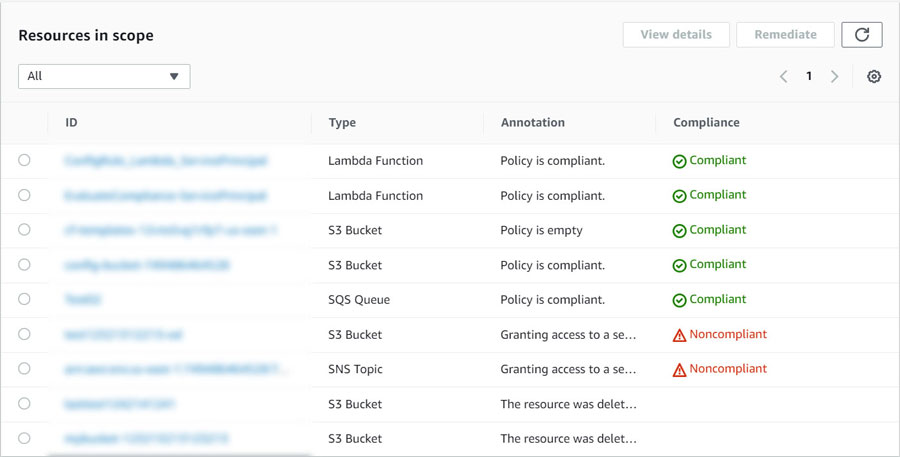

## Evaluate Compliance of Service Principals in Resource-Based Policies 
### AWS Custom Config Rule

This repository contains the Lambda function code and the CloudFormation template for an AWS Custom Config Rule designed to evaluate the compliance of AWS resource policies that grant access to service principals without proper access restrictions. The rule focuses on AWS S3 Buckets, SQS Queues, SNS Topics, and Lambda Functions, which are essential components in many AWS architectures but may become vulnerable if misconfigured.

### Lambda Function

The Lambda function performs the compliance evaluation by validating resource-based policies against best security practices using AWS Access Analyzer. It identifies whether policies grant overly permissive access to service principals without specifying a source and marks them as non-compliant.

### CloudFormation Template

The CloudFormation template sets up the Custom Config Rule, the Lambda function, and the necessary IAM roles and permissions. It defines the scope of the rule to target the applicable resource types and ensures proper access for the Lambda function to evaluate policies and report the compliance status to AWS Config.

### Result Screen
The following is an example of a result screen that showcases the outcomes of the evaluation:

### Enhance Security and Compliance

By utilizing this Custom Config Rule, you can enhance the security posture and compliance of your AWS resources, minimizing the risk of unauthorized access and potential security breaches. ***The solution offers a tailored evaluation for specified policies, filling the gap left by the absence of available AWS managed Config Rules and limitations in automatic findings from Access Analyzer at the time of its creation.*** Feel free to deploy the CloudFormation stack and leverage the Lambda function to safeguard your valuable AWS resources effectively.

Let's ensure secure AWS resource configurations together! Contributions and feedback are welcome as we work towards a more resilient AWS ecosystem.

### Additional Resources
AWS Access Analyzer [Reference Policy Checks: Security Warning - Restrict Access to Service Principal](https://docs.aws.amazon.com/IAM/latest/UserGuide/access-analyzer-reference-policy-checks.html#access-analyzer-reference-policy-checks-security-warning-restrict-access-to-service-principal)
